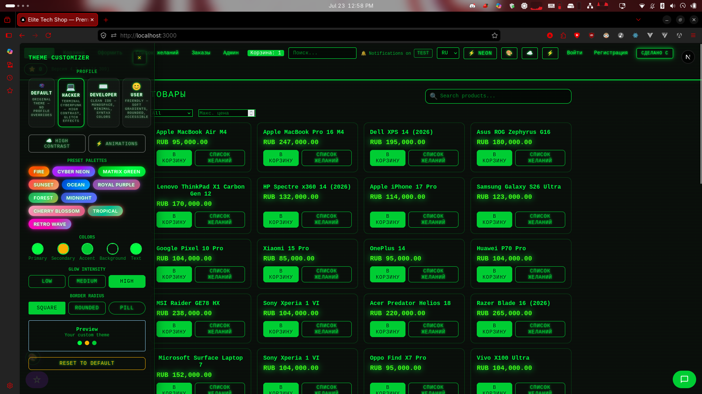
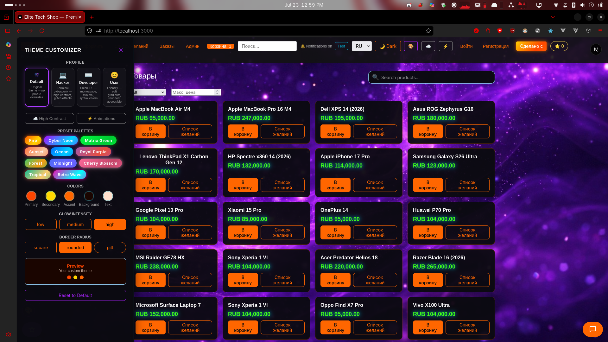
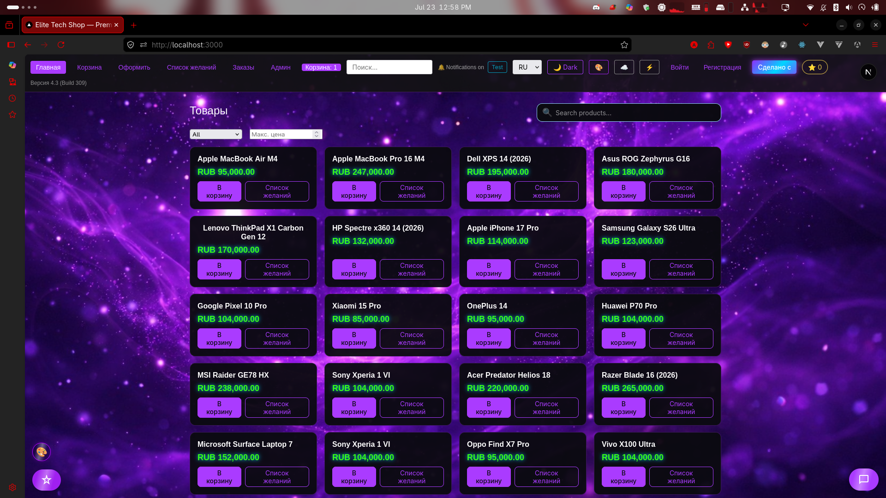

<div align="center">

# ⚡ [Elite Tech Shop](https://elite-shop-50-731fukl1n-arts009009009-1652s-projects.vercel.app/)

### *The Triple Backend Fusion — Rust × Java × Go*

**A full‑stack demo e‑commerce application with a neon‑dark Elite Tech vibe.**

React 19 · **Triple Backend** (Rust + Java + Go) · Minecraft Alpha Voxel Minigame · 10‑language i18n

*Built for chaos, speed, and full‑stack grind energy.*

---

<p>
<a href="https://github.com/arts009009009/Elite-Tech-Shop/discussions"></a>
<a href="https://github.com/arts009009009/Elite-Tech-Shop"></a>
<a href="https://github.com/arts009009009/Elite-Tech-Shop/discussions/11"></a>
<a href="https://elite-shop-50-731fukl1n-arts009009009-1652s-projects.vercel.app/"></a>
</p>

---

## 🛠 Tech Stack

<p align="center">
<a href="https://nextjs.org"></a>
<a href="https://react.dev"></a>
<a href="https://www.typescriptlang.org/"></a>
<a href="https://developer.mozilla.org/docs/Web/CSS"></a>
<a href="https://tailwindcss.com/"></a>
<a href="https://golang.org/"></a>
<a href="https://openjdk.org/"></a>
<a href="https://www.rust-lang.org/"></a>
<a href="https://developer.mozilla.org/docs/Web/JavaScript"></a>
<a href="https://webassembly.org/"></a>
<a href="https://nixos.org/"></a>
</p>

<p align="center">
<a href="https://www.npmjs.com/"></a>
<a href="https://pnpm.io/"></a>
<a href="https://yarnpkg.com/"></a>
<a href="https://bun.sh/"></a>
<a href="https://deno.com/"></a>
<a href="https://www.mozilla.org/firefox/"></a>
<a href="https://www.google.com/chrome/"></a>
<a href="https://ublockorigin.com/"></a>
</p>

---

## 📂 Source Code

The **`/Source Code`** folder is **always up to date**.  
Every commit reflects the latest changes — even if no new release has been published.

| Tier | Label | Speed | Status |
|------|-------|-------|--------|
| 1 | **Source Code** | 💾🔥 Fastest | Live, bleeding edge |
| 2 | **Canary** | 🧪 | Pre-release, experimental |
| 3 | **Stable** | 🔒 | Verified, production-ready |
| 4 | **LTS** | 🛡️ | ⚠️ Not supported |

- 🔄 Continuous updates: bug fixes, features, experiments land here first  
- 🕹️ Direct viewable code: browse backend, frontend, configs without cloning  
- 🛠️ Pull requests welcome: edit files, upload replacements, or propose changes directly  
- 🏷️ Releases are snapshots: tagged versions (like **5.0 Stable**) are milestones, but `/Source Code` may be ahead  

> ⚠️ Only supports **Stable** and **Canary** releases (no LTS).

---

## 🚀 Release Summary — 5.0 Stable

| Feature | Detail |
|---------|--------|
| Package managers | npm, pnpm, yarn, bun, deno |
| Frontend | Next.js 16 · React 19.2 · TypeScript 7 |
| Backends | Rust/Axum · Java/Spring · Go |
| Platforms | Linux, macOS, Windows, WSL |
| Browsers | Firefox + Chrome verified |
| Extensions | uBlock Origin tested |

---

## 📸 Showcase

<div align="center">

|  
|  
|  |

</div>

---

## ✨ Features

### 🛒 Core Commerce
- Product catalog — **Rust/Axum** (multi-language JSON)  
- Cart, orders, checkout, PDF export — **Go**  
- Wishlist, product comparison, flash sales, stock alerts  

### 🎯 Engagement
- Reviews & ratings  
- Rewards & referral program  
- Discount codes & promo system  

### 🔐 Admin & Analytics
- Admin dashboard — **Go**  
- Auth & user management — **Java/Spring**  

### 🎨 UI & UX
- Multi-theme system (Modern, Classic, Cyberpunk, Neon Green, Synthwave, Matrix, Vaporwave, Crimson, etc.)  
- Theme customizer (real-time color/font/style)  
- Light / Dark / High Contrast + `prefers-reduced-motion`  
- RTL support + 10 languages (EN, AR, RU, FR, ES, DE, ZH, JA, PT, HI)  
- Live search, voice search, AI shopping assistant, live chat, push notifications  

### 💻 Frostbite OS
Browser-based mini desktop: calculator, notepad, spreadsheet, presentation, word processor, media player, paint, task manager, web browser, WASM minigame  

### ⚡ Performance & Accessibility
- GPU acceleration with fallbacks  
- Lazy loading with Suspense boundaries  
- Keyboard navigation, skip-to-content, high contrast mode  

---

## 🏗️ Architecture

```
┌─────────────────────────────────────────────────┐
│           Browser (localhost:3000)               │
│              Next.js 16 Frontend                │
└──────────┬──────────┬──────────┬────────────────┘
           │          │          │
    ┌──────▼──┐  ┌────▼────┐  ┌──▼───────┐
    │ Rust    │  │ Java    │  │ Go       │
    │ /Axum   │  │ /Spring │  │ /net-http│
    │ :3002   │  │ :3001   │  │ :3003    │
    │ Products│  │ Auth    │  │ Cart     │
    └─────────┘  └─────────┘  │ Orders   │
                               │ Reviews  │
                               │ Rewards  │
                               └──────────┘
```

**Request flow:** `Browser → Next.js API Routes (proxy) → Backend Service → JSON response`  
All backend calls logged with `[BACKEND]` prefix for debugging.

---

## 📦 Installation & Setup

### Prerequisites
- Node.js 22+  
- Rust (stable) for WASM & Rust backend  
- Java 21+ (compile) / 26+ (run) for Spring Boot  
- Go 1.24+ for orders/cart  
- [Nix](https://nixos.org/download.html) (optional, recommended) — reproducible dev shell  

### Quick Start

```bash
# Option 1: Nix (recommended — all deps auto-installed)
nix develop
pnpm install && pnpm dev

# Option 2: Manual
git clone https://github.com/arts009009009/Elite-Tech-Shop.git
cd Elite-Tech-Shop
pnpm install   # or npm install / yarn install / bun install
pnpm dev       # or npm run dev / yarn dev / bun dev
```

### Start Backends

```bash
pnpm backend          # all backends
pnpm backend:rust     # Rust API → :3002
pnpm backend:java     # Java Auth → :3001
pnpm backend:go       # Go Orders/Cart → :3003
```

### Production Build

```bash
cd frontend && pnpm build
cd backend/rust && wasm-pack build --target web
docker-compose up --build
```

---

## 🔧 Infrastructure

| Component | Tool |
|-----------|------|
| Package management | pnpm workspace (npm/yarn/bun/deno compatible) |
| Dev builds | Turbopack |
| Compiler | Experimental React Compiler (Rust-native in Turbopack) |
| E2E testing | Playwright |
| Containers | Docker & Docker Compose |
| Dev environment | Nix flakes (cross-platform) |

---

## 🧪 Quality

| Check | Status |
|-------|--------|
| TypeScript strict mode | ✅ 0 errors |
| ESLint | ✅ 0 errors (1 acceptable warning: `eval` in calculator) |
| Hydration | ✅ SSR-safe, no mismatches |
| Auth Flow | ✅ Java-backed register/login/logout |
| i18n | ✅ 130 translation keys, 10 languages |

---

## 🏆 Hall of Fame

First commenter gets immortalized → [Discussion #3](https://github.com/arts009009009/Elite-Tech-Shop/discussions/3)

---

## 🏷️ Identity & Copyright

© **arts009009009** 2026 — Inventor of Triple Backend (Java + Rust + Go)  
© **Elite Tech** 2026 — Chaos Collective Branding

---
</div>
