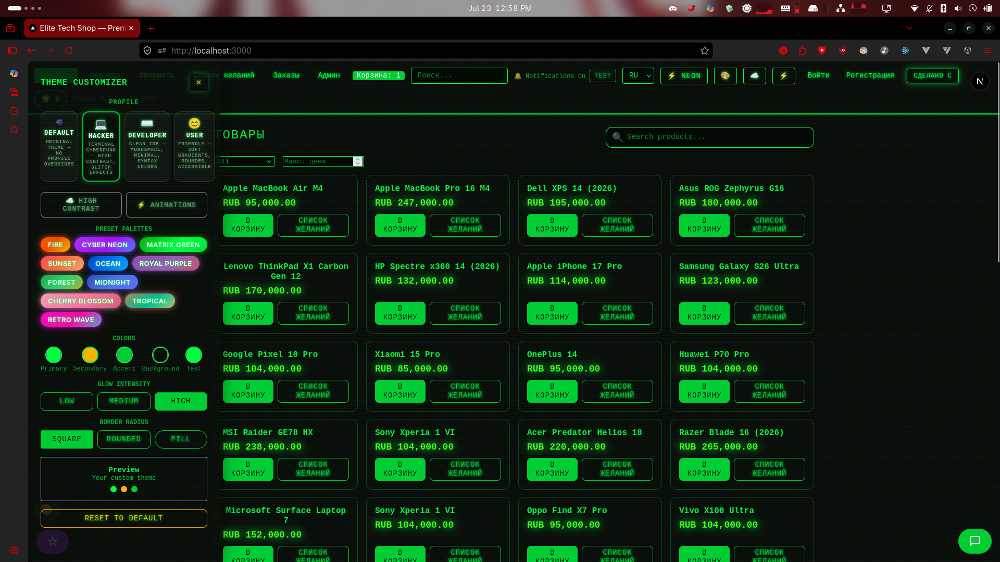
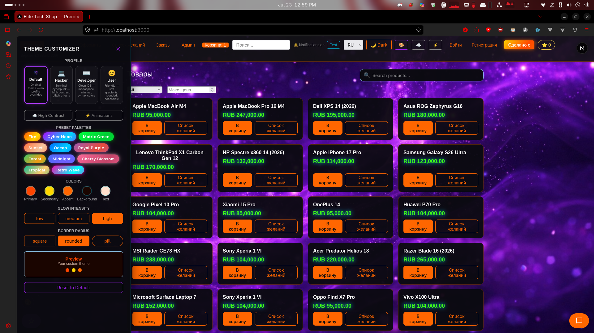
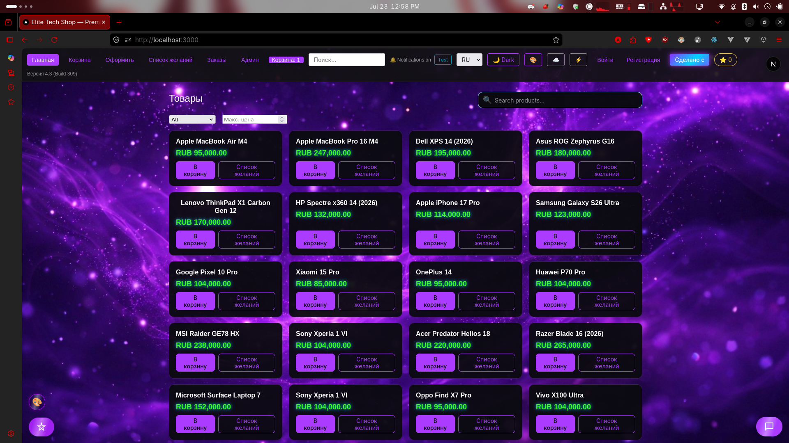

<div align="center">

# ⚡ Elite Tech Shop

### *The Triple Backend Fusion — Rust × Java × Go — plus a C++17 Calc Microservice*

**A full‑stack demo e‑commerce application with a neon‑dark Elite Tech vibe.**

React 19 · **Triple Backend** (Rust + Java + Go) · **C++ Calculator** · Minecraft Alpha Voxel Minigame · 10‑language i18n

> **Elite Tech Philosophy:** Crafting software that is rare, polished, and driven by pure chaos vibes — free from corporate locks and standard grind energy. Representing invention, the future, and relentless experimentation.

*Built for chaos, speed, and full‑stack grind energy.*

[](https://elite-shop-50-731fukl1n-arts009009009-1652s-projects.vercel.app/)
[](https://github.com/arts009009009/Elite-Tech-Shop)
[](https://github.com/arts009009009/Elite-Tech-Shop/discussions)
[](https://github.com/arts009009009/Elite-Tech-Shop/discussions/11)
[](https://github.com/arts009009009/Elite-Tech-Shop/blob/main/Source%20Code/LICENSE)
[](https://github.com/arts009009009/Elite-Tech-Shop/releases)

</div>

---

## 📑 Table of Contents

- [🛠 Tech Stack](#-tech-stack)
- [📂 Source Code](#-source-code)
- [🚀 Release Summary](#️-release-summary--52-canary-10)
- [📸 Showcase](#-showcase)
- [✨ Features](#-features)
- [🏗️ Architecture](#️-architecture)
- [📦 Installation & Setup](#installation--setup)
- [🔧 Infrastructure](#-infrastructure)
- [🧪 Quality](#-quality)
- [🏆 Hall of Fame](#-hall-of-fame)
- [🏷️ Identity & Copyright](#️-identity--copyright)
- [🙌 Credits & Licenses](#-credits--licenses)

---

## 🛠 Tech Stack

**Core**

<p align="center">
<a href="https://nextjs.org"></a>
<a href="https://react.dev"></a>
<a href="https://www.typescriptlang.org/"></a>
<a href="https://tailwindcss.com/"></a>
<a href="https://developer.mozilla.org/docs/Web/CSS"></a>
<a href="https://developer.mozilla.org/docs/Web/JavaScript"></a>
</p>

**Triple Backend**

<p align="center">
<a href="https://www.rust-lang.org/"></a>
<a href="https://spring.io/"></a>
<a href="https://golang.org/"></a>
</p>

**Calculator Microservice**

<p align="center">
<a href="https://isocpp.org/"></a>
<a href="https://cmake.org/"></a>
</p>

**Platform & Tooling**

<p align="center">
<a href="https://webassembly.org/"></a>
<a href="https://nixos.org/"></a>
<a href="https://www.docker.com/"></a>
<a href="https://playwright.dev/"></a>
</p>

**Compatible Package Managers**

<p align="center">
<a href="https://www.npmjs.com/"></a>
<a href="https://pnpm.io/"></a>
<a href="https://yarnpkg.com/"></a>
<a href="https://bun.sh/"></a>
<a href="https://deno.com/"></a>
</p>

**Verified Browsers & Extensions**

<p align="center">
<a href="https://www.mozilla.org/firefox/"></a>
<a href="https://www.google.com/chrome/"></a>
<a href="https://ublockorigin.com/"></a>
</p>

---

## 📂 Source Code

The **`/Source Code`** folder is **always up to date**. Every commit reflects the latest changes — even if no new release has been published.

| Tier | Label | Speed | Status |
|:----:|-------|:-----:|--------|
| 1 | **Source Code** | 💾🔥 Fastest | 🟢 Live, bleeding edge |
| 2 | **Canary** | 🧪 | 🟡 Pre-release, experimental |
| 3 | **Stable** | 🔒 | 🟢 Verified, production-ready |
| 4 | **LTS** | 🛡️ | 🔴 Not supported |

- 🔄 **Continuous updates** — bug fixes, features and experiments land here first
- 🕹️ **Direct viewable code** — browse backend, frontend and configs without cloning
- 🛠️ **Pull requests welcome** — edit files, upload replacements, or propose changes directly
- 🏷️ **Releases are snapshots** — tagged versions (like **5.2 Canary 10**) are milestones, but `/Source Code` may be ahead

> ⚠️ Only **Stable** and **Canary** releases are supported (no LTS).

---

## 🚀 Release Summary — 5.2 Canary 10

| Feature | Detail |
|---------|--------|
| Package managers | yarn 4 (npm / pnpm / bun / deno compatible) |
| Frontend | Next.js 16 · React 19.2 · TypeScript 7 · Tailwind 4 |
| Backends | Rust/Axum · Java/Spring · Go — plus C++17 calculator |
| Services | `:3000` · `:3001` · `:3002` · `:3003` · `:8084` |
| Testing | Playwright — 24/24 E2E green |
| Platforms | Linux, macOS, Windows, WSL |
| Browsers | Firefox + Chrome verified |
| Extensions | uBlock Origin tested |

---

## 📸 Showcase

<table align="center">
  <tr>
    <td align="center"><br/><sub><b>Hacker</b></sub></td>
    <td align="center"><br/><sub><b>Fire</b></sub></td>
    <td align="center"><br/><sub><b>Default</b></sub></td>
  </tr>
</table>

---

## ✨ Features

<details>
<summary><b>🛒 Core Commerce</b></summary>

- Product catalog — **Rust/Axum** (multi-language JSON)
- Cart, orders, checkout, PDF export — **Go**
- Wishlist, product comparison, flash sales, stock alerts
</details>

<details>
<summary><b>🎯 Engagement</b></summary>

- Reviews & ratings
- Rewards & referral program
- Discount codes & promo system
</details>

<details>
<summary><b>🔐 Admin & Analytics</b></summary>

- Admin dashboard — **Go**
- Auth & user management — **Java/Spring**
</details>

<details>
<summary><b>🎨 UI & UX</b></summary>

- Multi-theme system (Modern, Classic, Cyberpunk, Neon Green, Synthwave, Matrix, Vaporwave, Crimson, …)
- Theme customizer (real-time color / font / style)
- Light · Dark · High Contrast + `prefers-reduced-motion`
- RTL support + 10 languages (EN, AR, RU, FR, ES, DE, ZH, JA, PT, HI)
- Live search, voice search, AI shopping assistant, live chat, push notifications
</details>

<details>
<summary><b>💻 Frostbite OS</b></summary>

Browser-based mini desktop: **scientific & symbolic calculator** (desktop icon wired to the C++ service — evaluate, differentiate and plot), notepad, spreadsheet, presentation, word processor, media player, paint, task manager, web browser, WASM minigame
</details>

<details>
<summary><b>⚡ Performance & Accessibility</b></summary>

- GPU acceleration with graceful fallbacks
- Lazy loading with Suspense boundaries
- Keyboard navigation, skip-to-content, high contrast mode
</details>

---

## 🏗️ Architecture

```text
┌───────────────────────────────────────────────────────────────────┐
│                   Browser · http://localhost:3000                 │
│              Next.js 16 · React 19 Frontend (Turbopack)           │
└─────────┬────────────────┬────────────────┬───────────────────────┘
          │                │                │
          ▼                ▼                ▼                ▼
┌────────────────┐ ┌────────────────┐ ┌────────────────┐ ┌────────────────────┐
│  Rust / Axum   │ │ Java / Spring  │ │  Go / net-http  │ │  C++17 Calculator   │
│     :3002      │ │     :3001      │ │      :3003      │ │       :8084         │
├────────────────┤ ├────────────────┤ ├────────────────┤ ├────────────────────┤
│ Products       │ │ Auth           │ │ Cart            │ │ evaluate            │
│ Catalog        │ │ Users          │ │ Orders          │ │ differentiate       │
│ Categories     │ │ Sessions       │ │ Reviews         │ │ plot                │
│ Health         │ │ Health         │ │ Rewards · PDF   │ │ symbolic math       │
└────────────────┘ └────────────────┘ └────────────────┘ └────────────────────┘
```

**Request flow:** `Browser → Next.js rewrites (frontend/next.config.ts) → Backend Service → JSON response`

| Route prefix | Service |
|--------------|---------|
| `/api/products`, `/api/categories`, `/api/health` | Rust `:3002` |
| `/api/auth` | Java `:3001` |
| `/api/cart`, `/api/wishlist`, `/api/orders`, `/api/reviews`, `/api/rewards` | Go `:3003` |
| `/api/calc` (`evaluate`, `differentiate`, `plot`) | C++ `:8084` |

All backend calls are logged with a `[BACKEND]` prefix for debugging.

| Service | Port | Responsibility |
|---------|:----:|----------------|
| Next.js frontend | `3000` | UI, SSR, API proxy |
| Java / Spring | `3001` | Auth, users, sessions |
| Rust / Axum | `3002` | Products, catalog |
| Go / net-http | `3003` | Cart, orders, reviews, rewards, PDF |
| C++17 calculator | `8084` | Scientific & symbolic math for Frostbite OS |

---

## 📦 Installation & Setup

### Prerequisites

| Tool | Version | Notes |
|------|---------|-------|
| Node.js | 22+ | Frontend runtime |
| Yarn | 4.x (`corepack enable`) | Pinned via `packageManager` |
| Rust | stable | Products API |
| Java | 21+ (compile) / 26+ (run) | Spring Boot auth service |
| Go | 1.25+ | Cart / orders API |
| CMake | 3.16+ | C++ calculator (plus a C++17 compiler) |
| [Nix](https://nixos.org/download.html) | optional | Reproducible dev shell (recommended) |

### Quick Start

**Option 1 — Nix (recommended, toolchain auto-provided)**

```bash
nix develop
```

**Option 2 — Manual**

```bash
git clone https://github.com/arts009009009/Elite-Tech-Shop.git
cd Elite-Tech-Shop/"Source Code"

corepack enable      # once — provides the pinned Yarn 4
yarn install:all     # installs root (Playwright) + frontend dependencies
yarn dev             # builds the C++ calc and starts all five services
```

`yarn dev` boots everything: Next.js `:3000`, Java `:3001`, Rust `:3002`, Go `:3003`, C++ calculator `:8084`.

### Start Services Individually

```bash
yarn backend          # all backends (Rust + Java + Go + C++ calc)
yarn backend:rust     # Rust API       → :3002
yarn backend:java     # Java Auth      → :3001
yarn backend:go       # Go Orders/Cart → :3003
yarn backend:calc     # C++ Calculator → :8084 (CMake build + run)
```

### Testing

```bash
yarn dev              # keep all services running
yarn test             # Playwright — 24 E2E tests across 7 specs
```

### Production Build

```bash
yarn build                                    # Next.js production bundle
cd backend && mvn package                     # Spring Boot jar
cd backend/rust && cargo build --release      # products-service
cd backend/go && go build -o ../go-backend .  # go-backend
cd backend/cpp-backend && cmake -B build && cmake --build build -j

# optional container workflow
docker-compose up --build
```

---

## 🔧 Infrastructure

| Component | Tool |
|-----------|------|
| Package management | Yarn 4 (node-modules linker) — npm / pnpm / bun / deno compatible |
| Dev builds | Turbopack |
| Compiler | Experimental React Compiler (Rust-native in Turbopack) |
| E2E testing | Playwright (Chromium) |
| Containers | Docker & Docker Compose |
| Dev environment | Nix flakes (cross-platform) |

---

## 🧪 Quality

| Check | Status |
|-------|--------|
| E2E (Playwright) | ✅ 24/24 passing — auth, cart, calculator, home, navigation, products, push |
| TypeScript strict mode | ✅ `tsc --noEmit` clean |
| Calculator backend | ✅ 73 parser + 34 derivative + 390 fuzz cases; HTTP 400 error contract |
| Push notifications | ✅ Service worker push + notificationclick, flight-request bypass |
| Version sync | ✅ 5.2 Canary 10 across navbar, health endpoints, pom, Cargo, CMake, package.json |
| Auth Flow | ✅ Java-backed register / login / logout |
| Hydration | ✅ SSR-safe, no mismatches |
| i18n | ✅ 130 translation keys, 10 languages + RTL |

---

## 🏆 Hall of Fame

First commenter gets immortalized → **[Hall of Fame](https://github.com/arts009009009/Elite-Tech-Shop/discussions/11)**

---

## 🏷️ Identity & Copyright

© **arts009009009** 2026 — Inventor of Quad Backend (Java + Rust + Go + C++)
© **arts009009009** 2026 — Inventor of Triple Backend (Java + Rust + Go)
© **arts009009009** 2026 — Inventor of Dual Backend (Java + Rust)

© **Elite Tech** 2026 — Rare, Polished, Chaos Engineering & Future Tech

---

## 🙌 Credits & Licenses

This project integrates community chaos upgrades shared under the MIT License:

- [Block Dark Mode Extensions](https://www.shahriaravi.me/writing/block-dark-mode-extensions) — Prevents forced dark mode from breaking site design.
- [Oprogress](https://github.com/programming-with-ia/oprogress) — Progress bar enhancements for smoother UI.

All above projects are © their respective authors, licensed under MIT.

Elite Tech Shop credits them for powering chaos browsing and resilient UI.

---

<div align="center">

**⚡ Built for chaos, speed, and full‑stack grind energy ⚡**

[](https://github.com/arts009009009/Elite-Tech-Shop)

</div>
